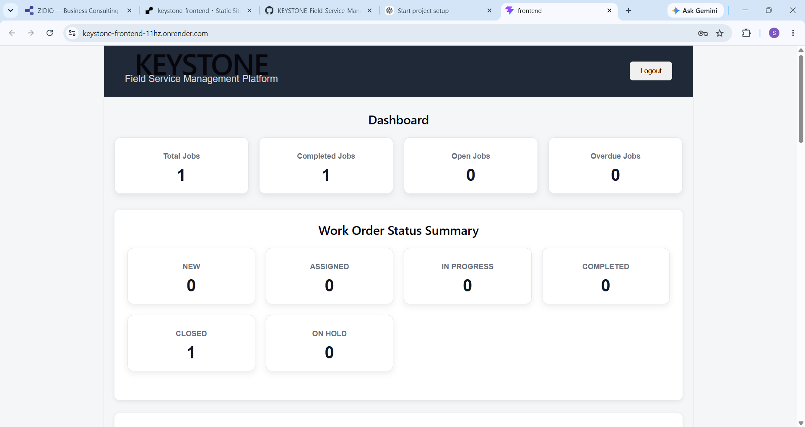
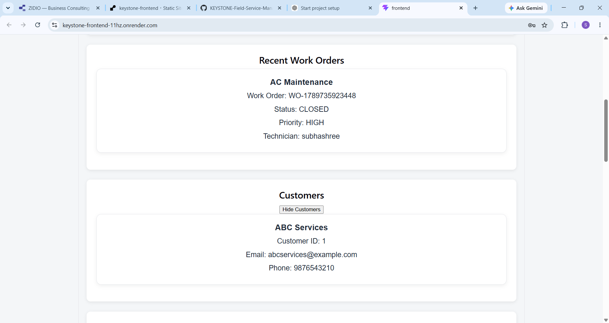
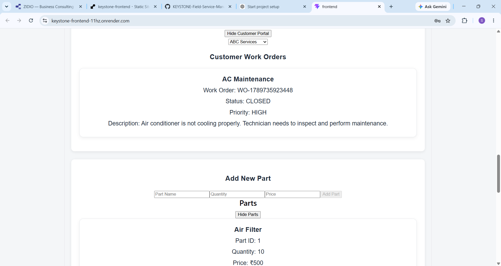
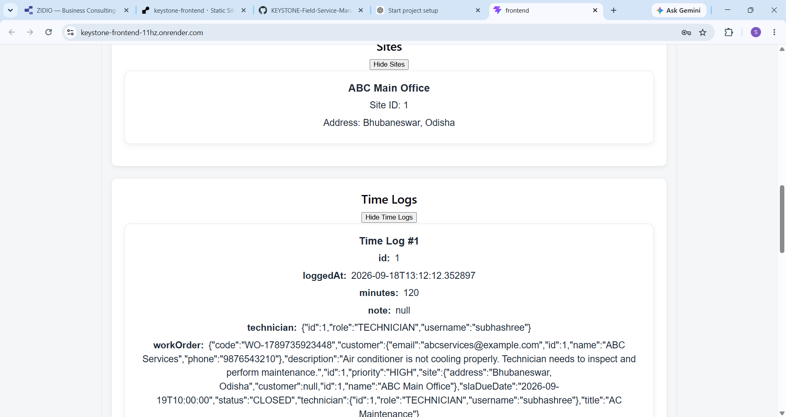
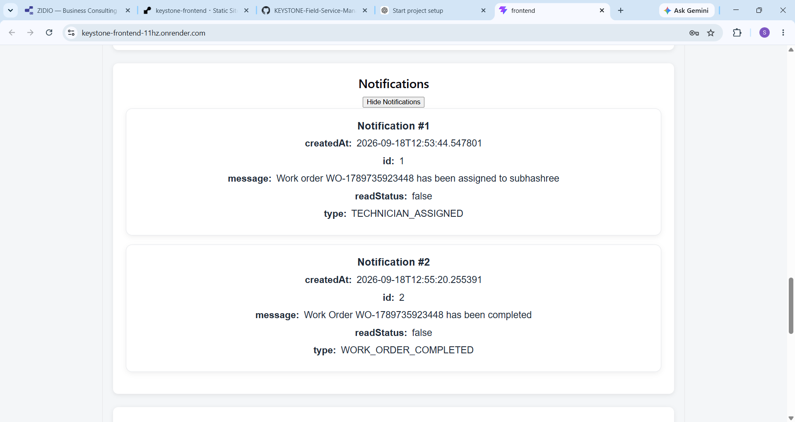
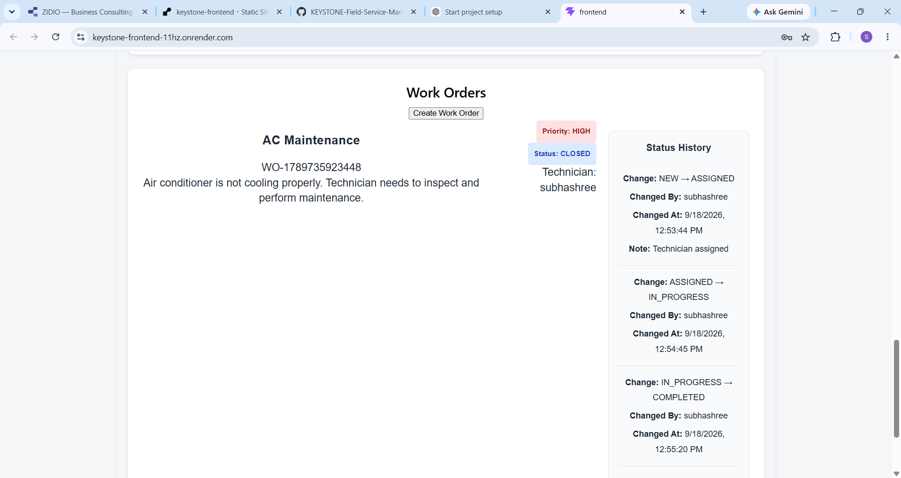

# Project KEYSTONE – Field Service Management Platform

## Live Demo

**Frontend:**  
https://keystone-frontend-11hz.onrender.com

**Backend:**  
https://keystone-backend-jxxj.onrender.com

**GitHub Repository:**  
https://github.com/subhashree9538/KEYSTONE-Field-Service-Management

## Overview

Project KEYSTONE is a Field Service Management Platform designed to help organizations manage customers, service sites, work orders, technicians, parts, time tracking, notifications, audit logs, SLA tracking, and customer access from a centralized system.

The platform supports the complete work-order lifecycle:

**NEW → ASSIGNED → IN_PROGRESS → COMPLETED → CLOSED**

## Project Objectives

- Manage service requests and work orders
- Assign technicians to work orders
- Track work-order status and SLA deadlines
- Maintain customers and service sites
- Track parts and technician time
- Provide notifications and audit logs
- Provide customer access through a Customer Portal
- Secure APIs using JWT authentication
- Provide a centralized dashboard

## Main Features

- JWT-based authentication
- Role-based access
- User management
- Customer management
- Site management
- Work-order creation and management
- Technician assignment
- Work-order status lifecycle
- Work-order status history
- SLA due-date and overdue tracking
- Parts management
- Time logging
- Notifications
- Audit logging
- Customer Portal
- Dashboard
- Swagger / OpenAPI documentation

## Work-Order Lifecycle

A work order follows this workflow:

1. NEW
2. ASSIGNED
3. IN_PROGRESS
4. COMPLETED
5. CLOSED

Every status change is recorded in the work-order status history.

## Modules

### 1. Authentication

Users can securely log in using username and password.

Authentication is implemented using:

- Spring Security
- JWT
- BCrypt password hashing

### 2. Dashboard

The dashboard provides an overview of:

- Total Jobs
- Completed Jobs
- Open Jobs
- Overdue Jobs
- Work-order status summary

### 3. Customer Management

The system allows management of customer information such as:

- Customer name
- Email
- Phone

### 4. Site Management

Service locations can be associated with customers.

Example:

**ABC Main Office – Bhubaneswar, Odisha**

### 5. Work Orders

Users can create and manage work orders with:

- Work-order title
- Description
- Priority
- Customer
- Site
- SLA due date
- Technician
- Status

### 6. Technician Assignment

Work orders can be assigned to technicians.

The system records the assignment and generates related notifications and audit information.

### 7. Status Tracking

Technicians can move work orders through the defined lifecycle:

**NEW → ASSIGNED → IN_PROGRESS → COMPLETED → CLOSED**

### 8. Status History

All important status changes are stored with information such as:

- Previous status
- New status
- Changed by
- Change note
- Timestamp

### 9. Time Logs

Technicians can record time spent working on a work order.

Example:

**120 minutes – AC maintenance work**

### 10. Parts

The system maintains part information such as:

- Part name
- Quantity
- Price

### 11. Notifications

The system generates notifications for important work-order events such as:

- Technician assignment
- Work-order completion

### 12. Audit Logs

Important system actions are recorded for tracking and accountability.

Examples:

- Technician assigned
- Work-order status changed

### 13. Customer Portal

Customers can view their work orders and related information including:

- Work-order code
- Title
- Description
- Priority
- Status
- Service site
## Screenshots

### Dashboard


### Customers


### Customer Portal & Parts


### Sites & Time Logs


### Notifications


### Audit Logs


### Work Orders

## Technology Stack

### Backend

- Java 21
- Spring Boot 4.0.8
- Spring Security
- JWT Authentication
- Spring Data JPA
- Hibernate
- PostgreSQL
- Maven
- Swagger / OpenAPI

### Frontend

- React
- TypeScript
- Vite
- HTML
- CSS

### Database

- PostgreSQL

### Deployment

- GitHub
- Render

## Architecture

The application follows a layered architecture:

```text
React + TypeScript Frontend
            |
            | REST API
            v
Spring Boot Backend
            |
     Controller Layer
            |
       Service Layer
            |
     Repository Layer
            |
            v
       PostgreSQL
```
## JWT Authentication Flow

User Login
    |
    v
React Frontend
    |
    v
Spring Boot Login API
    |
    v
Username + Password Validation
    |
    v
BCrypt Password Verification
    |
    v
JWT Token Generated
    |
    v
Token Stored by Frontend
    |
    v
Protected API Requests

## API Modules

The backend provides REST APIs for:

- Authentication
- Users
- Customers
- Sites
- Work Orders
- Time Logs
- Parts
- Notifications
- Audit Logs
- Customer Portal

Swagger / OpenAPI is also configured for API documentation.

## Project Structure

```text
KEYSTONE-Field-Service-Management/
│
├── src/
│   └── main/
│       ├── java/
│       │   └── com.example.demo/
│       │       ├── config/
│       │       ├── controller/
│       │       ├── entity/
│       │       ├── repository/
│       │       ├── security/
│       │       └── service/
│       │
│       └── resources/
│           └── application.properties
│
├── frontend/
│   ├── src/
│   ├── package.json
│   └── vite.config.ts
│
├── pom.xml
├── Dockerfile
├── README.md
└── .gitignore
```
